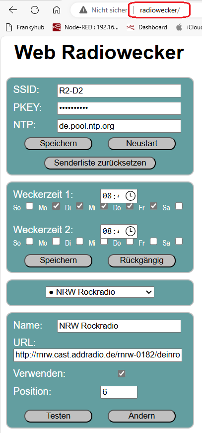

# Radiowecker
Bedienung über 2,8" Touchscreen, 3W Klasse D Amplifier, OTA und WEB-Server

## Story
Das Repo beschreibt einen Radiowecker mit OTA-Funktion und WEB-Server. Die Bedienung erfolgt ausschließlich über den 2,8" Touchscreen. Es gibt zwei Weckzeiten, welche beliebigen Wochentagen zugeordnet werden können. Natürlich ist auch ein Einschlaf-Timer vorhanden. Mit einem optionalen LDR kann die Display-Helligkeit automatisch an die Raumhelligkeit angepasst werden. Lautstärke, Einschlafzeit, Display-Helligkeit und Senderwahl können über den Touchscreen eingestellt werden. Weckzeiten und die Stream-URLs der Radiostationen werden über ein Web-Interface konfiguriert.

## Inbetriebnahme

### Verdrahtung 

| TFT-Display | ESP32 | 
| -------- | -------- | 
|  VCC  |  3,3V  |
|  GND |   GDN |
| CS  | GPIO5  |
| RESET  | GPIO22   |
| DC | NC  |
| SDI  | GPIO23    |
| SCK  |  GPIO18  |
|  LED |  NC  |
|  MISO | GPIO19   | 
| T-CLK  | GPIO18 |    
| T-CS  | GPIO14  | 
| T-DIN  | GPIO23  | 
| T-DO  | GPIO19  | 
| T-IRQ  | GPIO27  | 
|  --- |  --- | 

### Nach anlegen der Versorgungsspannung startet der Accesspoit. In den Einstellungen des Handys oder Tablets wird das WLAN "Radiowecker" ausgewählt 

### und über einen Browser die URL 192.168.4.1 eingegeben und der Neutart-Button betätigt.

### Am Seriellen Monitor kann der Startvorgang beobachtet und die IP-Adresse des WEB-Servers abgelesen werden.

### Am Display wird die WLAAN-Verbindung angezeigt.

### Nach dem Aufruf des WEB-Server sieht man die Einstellungen und passt diese an.

### Die Bedienung kann auch über das TFT-Display erfolgen.

## Bedienung

### Radio ei/aus
Das Radio wird ein- oder ausgeschaltet. Die Anzeige kehrt zur Zeitanzeige zurück. Wurde das Radio eingeschaltet, erscheint unter der Zeitanzeige der Radioblock mit dem Sendernamen und den Metadaten z.B. Name des geraden gespielten Liedes, wenn diese der Sender mit überträgt. Das ist leider nicht immer der Fall.

### Einschlaftimer
Die Einschlafzeit wird gestartet. Falls das Radio nicht eingeschaltet ist, wird es eingeschaltet. Die Anzeige kehrt zur Zeitanzeige zurück. Wenn die eingestellte Einschlafzeit vorüber ist, wird das Radio automatisch ausgeschaltet.

### Wecker ein/aus
Die Wecker-Funktion wird ein- oder ausgeschaltet. Die Anzeige kehrt zur Zeitanzeige zurück. Wurde der Wecker eingeschaltet, erscheint ganz unten im Display der Wochentag und die Uhrzeit, wann der Wecker das nächste Mal ausgelöst wird. Wenn der angezeigte Wochentag und die Uhrzeit zutreffen, wird das Radio automatisch eingeschaltet.

### Sender speichern
Der ausgewählte Sender wird als aktiver Sender übernommen. Ist das Radio gerade eingeschaltet, so wechselt der Stream automatisch auf den neuen Sender. Die Anzeige kehrt zur Zeitanzeige zurück.

### Zurück
Die Anzeige kehrt zur Zeitanzeige zurück.

## Erfolgt 10 Sekunden keine Aktivität, so kehrt die Anzeige automatisch zur Zeitanzeige zurück. Alle Einstellungsänderungen werden in den Präferenzen gespeichert. Die Bedienungsseite wird immer mit voller Helligkeit dargestellt.

## OTA-Funktion

## Über die URL http://radiowecker/ sollte die Konfigurationsseite abrufbar sein. 

## Im oberen Teil können die Zugangsdaten und der NTP-Server geändert werden. Die Änderungen werden erst dann wirksam, wenn der Knopf „Speichern“ geklickt wurde. Mit dem Knopf „Neustart“ kann ein Neustart ausgelöst werden. Als Nächstes folgen die Weckzeiten. Es können zwei Weckzeiten eingestellt werden. Für jede der Weckzeiten können die Wochentage gewählt werden, an denen die Weckzeiten anzuwenden sind. Die Dropdown-Liste darunter enthält alle Sender der Senderliste. Auswählbare Sender haben vor dem Namen einen schwarzen Punkt. Im Formular darunter werden die Daten zur ausgewählten Station angezeigt und können geändert werden. Ist das Häkchen bei „Verwenden“ nicht gesetzt, kann die Station im Gerät nicht ausgewählt werden. Da manche URLs nicht funktionieren, sollte eine neue URL mit dem Knopf „Testen“ getestet werden. Ein Klicken auf diesen Knopf startet die Wiedergabe der URL am Gerät. Am Gerät muss das Radio dabei zum Testen eingeschaltet sein. Sollte die Wiedergabe nicht funktionieren, wird sofort wieder auf den aktuellen Sender zurückgeschaltet und eine Meldung angezeigt. Ist die Wiedergabe möglich, wird eine Box mit einem Knopf angezeigt. Klicken auf diesen Knopf schließt die Box und beendet den Test. Es wird wieder die aktuelle Station wiedergegeben. Im Eingabefeld „Position“ wird die Position der ausgewählten Station innerhalb der Senderliste angezeigt. Durch eine Änderung dieses Wertes, kann die Station auf die angegebene Position verschoben werden. Mit dem Knopf „Ändern“ können die Änderungen für die ausgewählte Station dauerhaft geändert werden.

---

   
<ol class="breadcrumb" style="border-top: 2px solid black;border-bottom:2px solid black; height: 45px; width: 900px;"> 
<a href="#oben">nach oben</a>
</ol>

  
---

